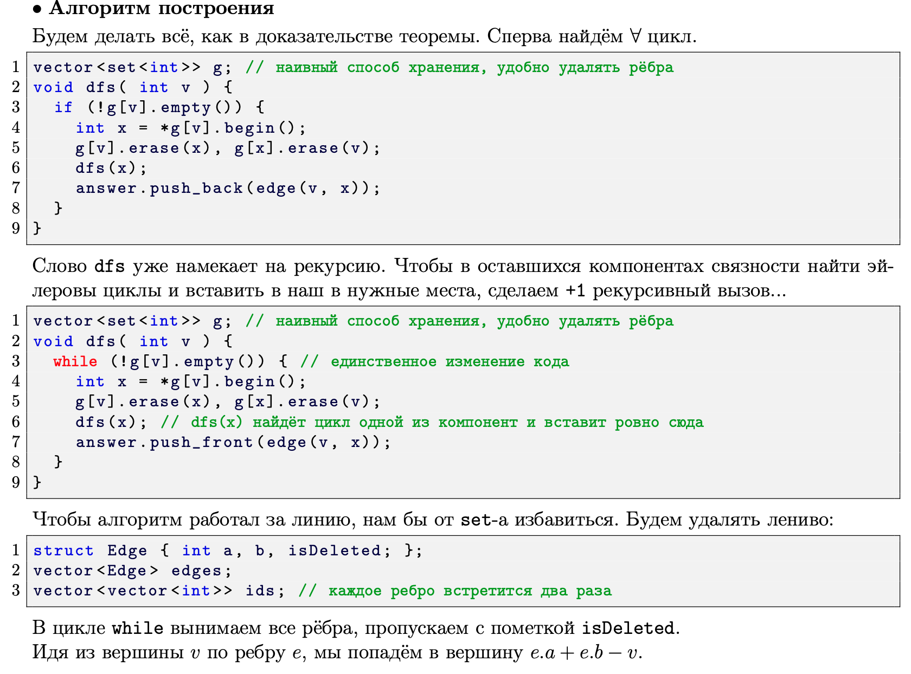

# Билет 2
- Эйлеров путь -  путь, который проходит по каждому ребру графа, причем ровно один раз
- Эйлеров цикл - замкнутый эйлеров путь
- Граф эйлеров, если все вершины графа имеют четную степень, если же граф ориентированный, то его эйлеровость определяется равенством входящих и исходящих ребер каждой вершины


##### [Ссылка на еще одно более подробное описание](http://neerc.ifmo.ru/wiki/index.php?title=%D0%AD%D0%B9%D0%BB%D0%B5%D1%80%D0%BE%D0%B2%D0%BE%D1%81%D1%82%D1%8C_%D0%B3%D1%80%D0%B0%D1%84%D0%BE%D0%B2)

## Построение Эйлерова цикла





- Для ориентированного случая делаем 
все то же самое, только теперь ребра не нужно удалять, все хранить можно в ```vector<vector<Edge>>```
