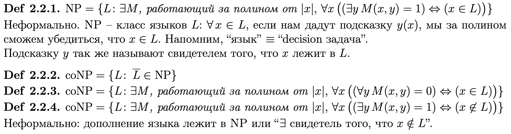
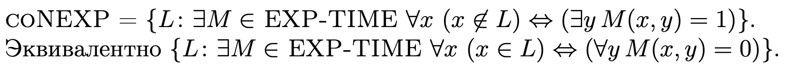

# Билет 7
## Классы NP, coNP, coNEXP

### Простым языком:
- **NP** - класс языков (задач), ответ на которые можно проверить за полиномиальное время.
- **coNP** - это множество языков, для которых
 существует работающая за полиномиальное время детерминированная программа-верификатор R(x,y) а для каждого слова из языка (и только для слова из языка) можно предъявить сертификат полиномиальной длины, подтверждающий принадлежность слова языку и проверяемый верификатором.
- **coNEXP** - то же, что и выше, только время экспоненциальное.

## Примеры

- **MAX-CLIQUE** - лежит в NP. Сводится к 3-SAT. [ссылка на пояснения](https://www.cs.cmu.edu/~avrim/451f11/lectures/lect1108.pdf)
- **coPRIME** - нужно проверить, является ли число составным. лежит в coNP
