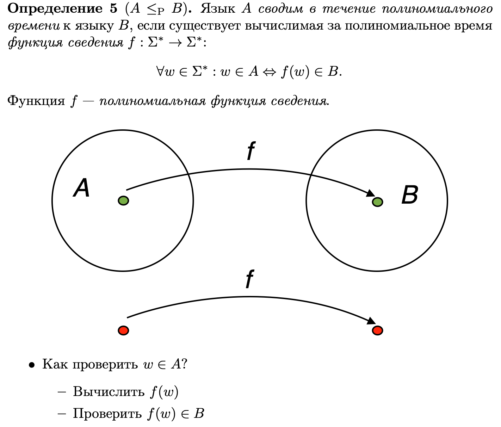
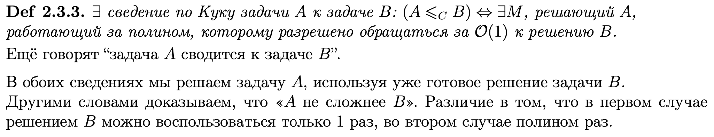
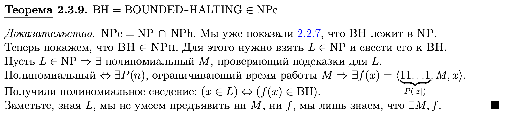
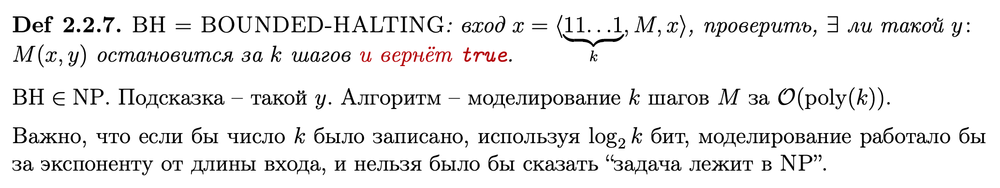

# Билет 8
## Классы NP-hard, NP-complete

### Простым языком: 
- **NP-трудная** задача имеет тот смысл, что эта задача не проще, чем «самая трудная в NP».
- Задача называется **NP-трудной** если каждая задача из NP полиномиально сводится к ней.
- Задача называется **NP-полной**, если она входит в NP и каждая задача из NP полиномиально сводится к ней (т.е. является NP-трудной).
- **NP-полные** задачи понимаются как самые трудные задачи из класса NP.

## Полиномиальное сведение

## Сведение по Куку

### Простым языком:
- Обращаться к задаче можем сколько угодно раз за время O(1)

## BH ∈ NP-complete

### Напоминалка 

