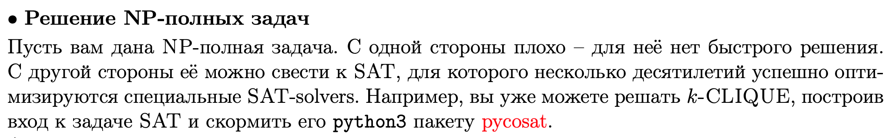

# Билет 9
## Задачи максимизации

## search → decision

- **Говорим уверенным голосом:** у нас есть алгоритм который решает decision версию теперь возьмем и сведем ее к SAT, там восстанавливаем набор 
из этого набора как-то получаем решение к search (если кто-то читает это и считает что это неправильно поправьте)
## search 3-SAT → search k-IND
[СП обьясняет](https://www.coursera.org/lecture/advanced-algorithms-and-complexity/3-sat-to-independent-set-L47nL)

## Решение NP - задач

