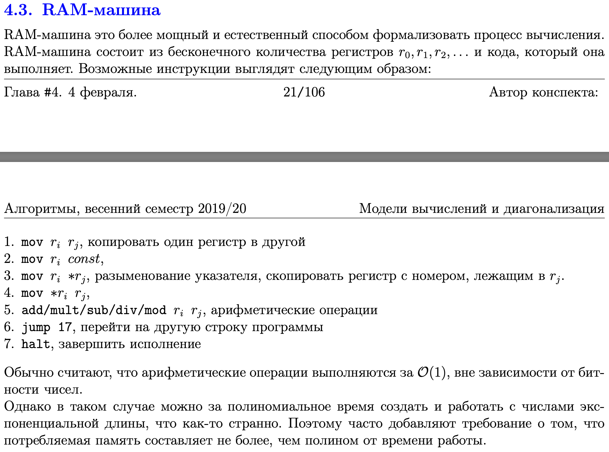
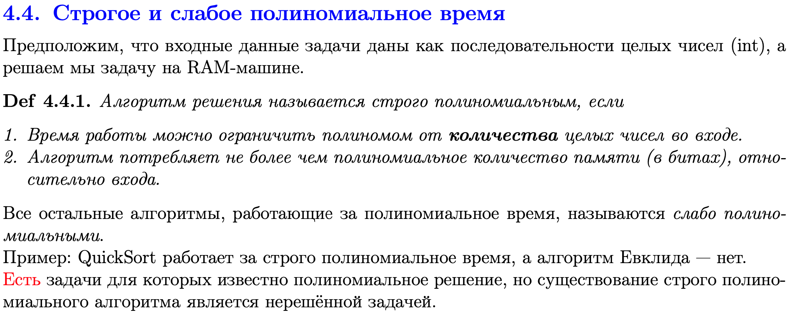

# Билет 10
## Машина Тьюринга

### Авторское объяснение: 
Есть какой-то заданный алфавит, который может принимать машина. Есть лента, на ней просто хаданы входные данные из алфавита.
То просто какие-то бесконечные входные данные. Алгоритм задается примерно так: есть таблица, строки этой таблицы - символы, используемые во входных данных; столбцы - состояния.
Алгоритм ходит по входной ленте и изменяет состояние наших входных данных. Алгоритм выполняется по столбцам, то есть столбцы(состояния) как-то на друг друга ссылаются и говорят как именно изменять входные данные. 
После завершения работы получаем ленту выходных данных. (это если совсем просто, правильнее читать с конспекта)

## RAM-машина

### Тут немного понятнее:
[Википедия](https://ru.wikipedia.org/wiki/RAM-машина)

## Другое определение класса NP
- Язык L принадлежит классу NP, если существует полином q и недетерминированная машина Тьюринга, которая распознает L за время q(n).
- Тут есть доказательство эквивалентности
[конспект МГУ](http://web.archive.org/web/20180712225703/http://lpcs.math.msu.su/~krupski/Complexity/krupski/part3.pdf)

## Понятие строгой-нестрогой полиномиальности

