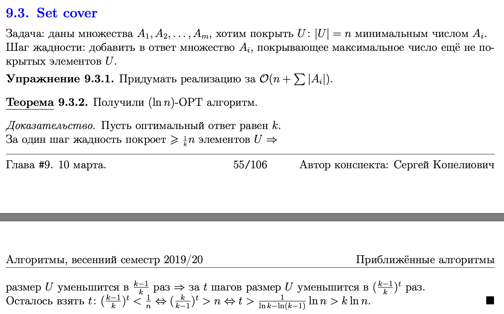
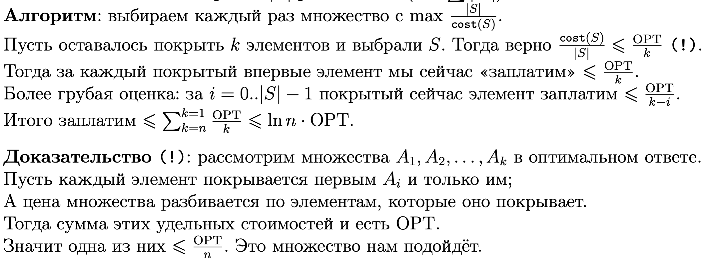
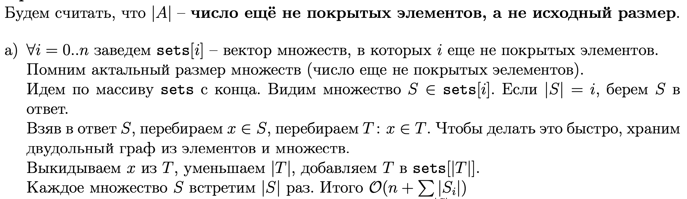
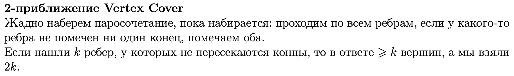

# Билет 55
## Set cover

## ln(n)-приближение во взвешенном случае
- **|A|** – число ещё не покрытых элементов, а не исходный размер

## Реализация за линейное время в невзвшенном случае

## 2-OPT приближение для Vertex Cover

