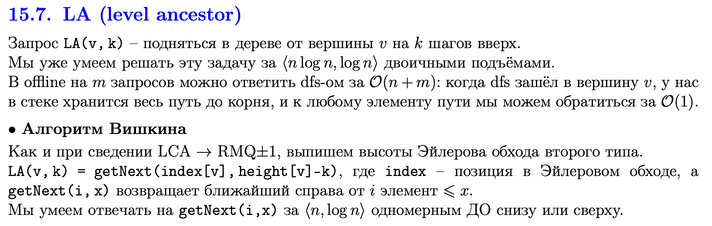
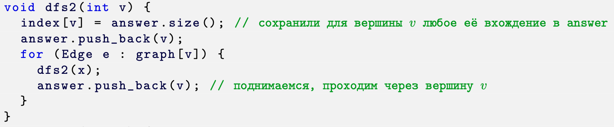
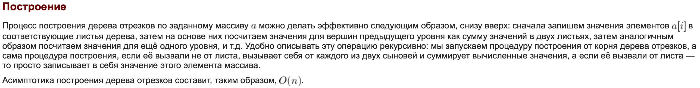

## Билет 92
Автор: Габитов Даниил

На [лекции](https://youtu.be/d9fBIjjOcaI?t=4566) обьяснили за 5 минут. Note: спуск как в k-ой статистике за log.

## Алгоритм Вишкина

## Напоминалка: эйлеров обход второго типа

## Напоминалка: ДО

