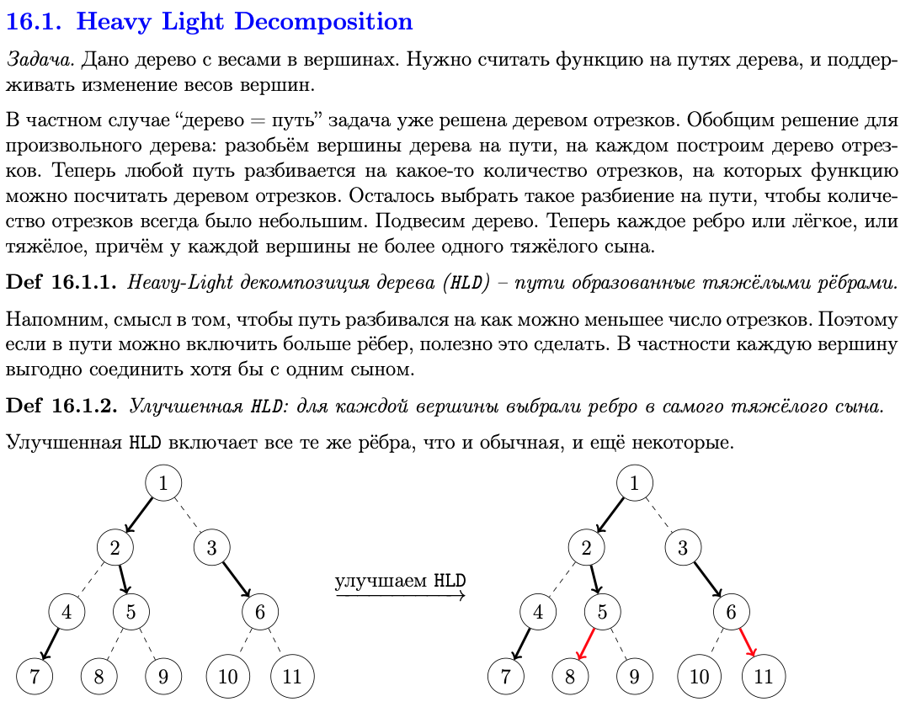
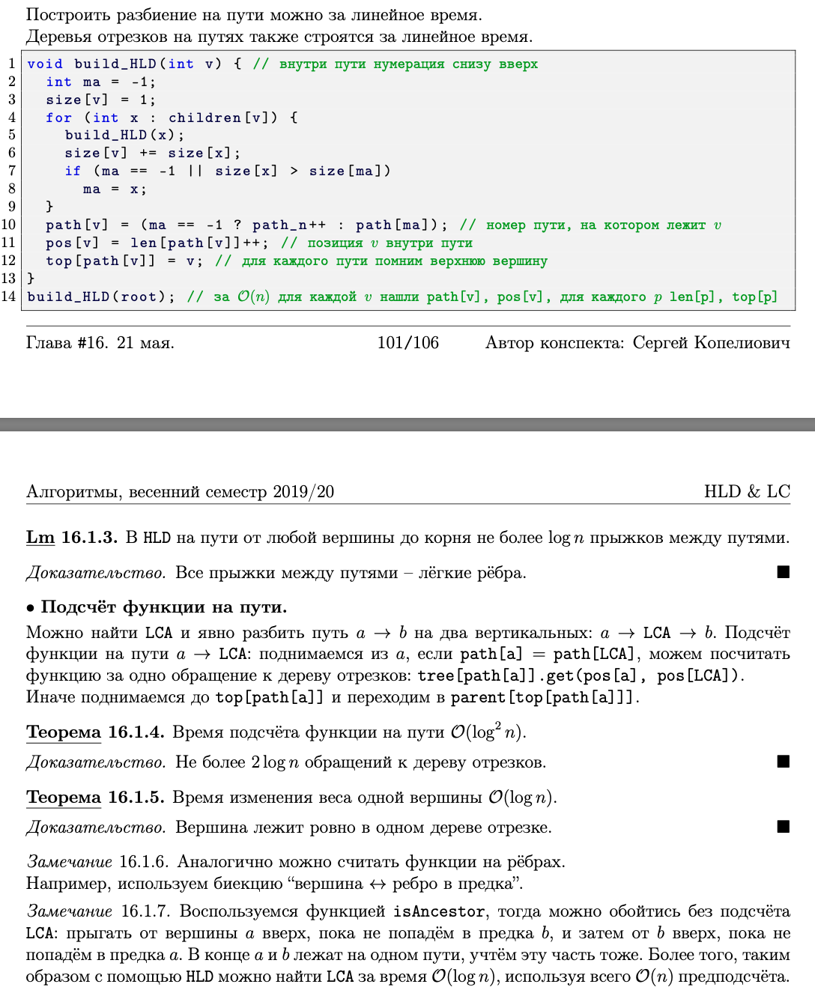

# Билет 95
Автор: Габитов Даниил

- **Идея простая:** разобьем наше дерево на пути, на которых построим ДО. Построим так, чтобы было не больше log переходов между путями. Поэтому будем соединять вершины по самым тяжелым ребрам. Тогда на пути будет не более log ребер перехода т.к. они легкие и уменьшают размер дерева в 2 раза.
  
- **Пример:** поиск минимума на пути. NOTE: в hld веса в вершинах.
  
- **Можно сделать еще лучше:** добавить возможность запросов по поддереву. Для этого немного переструктурируем дерево так, чтобы все наши выбранные ребра были слева. Сделаем Эйлеров обход. Тогда, запрос на дереве превращается в запрос на массиве(рассматриваем интересующее нас поддерево). Заметим, что теперь вершины стоят в удобном нам порядке, а именно образуют тяжелые пути. 

## [Лекция](https://youtu.be/TSRPgTLfZt8?t=246)
## Heavy-Light Decomposition

## Построение

## Пример использования

