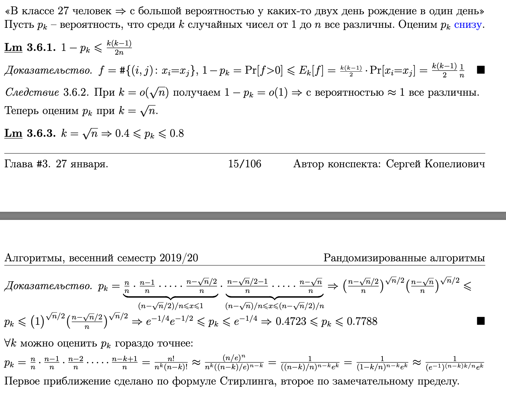

# Билет 18
## Парадокс дней рождений + анализ вероятности в две стороны

- Если вдруг непонятно откуда берется такая вероятность читаем это: 
нам нужно посчитать вероятность того, что ДР не совпадет для первого человека берем 365/365. Тогда для второго убираем один день, получаем вероятность 354/365. (перемножаем это значение)
Заметим, что проделывая это дальше получаем то что нужно.
- Ещё нужно осознать какой-то матанализ с оценками
